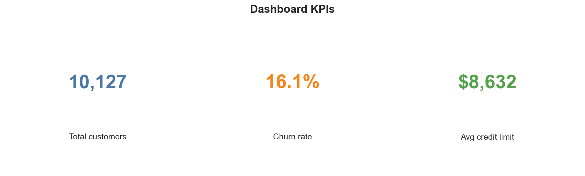
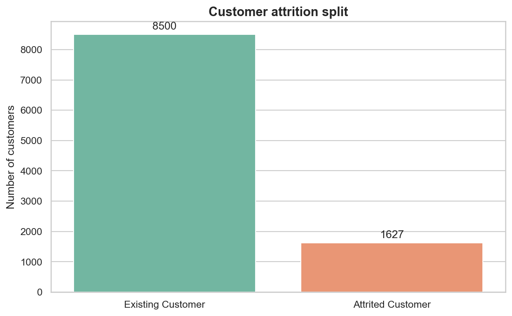
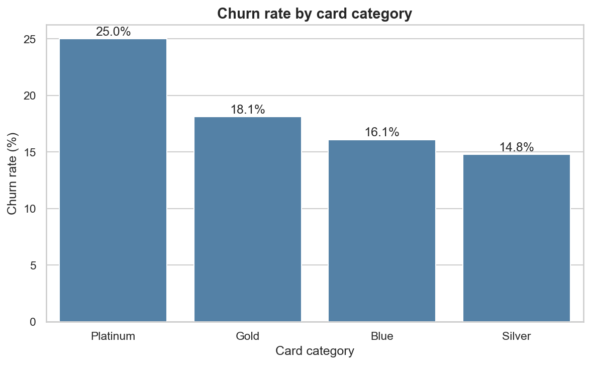
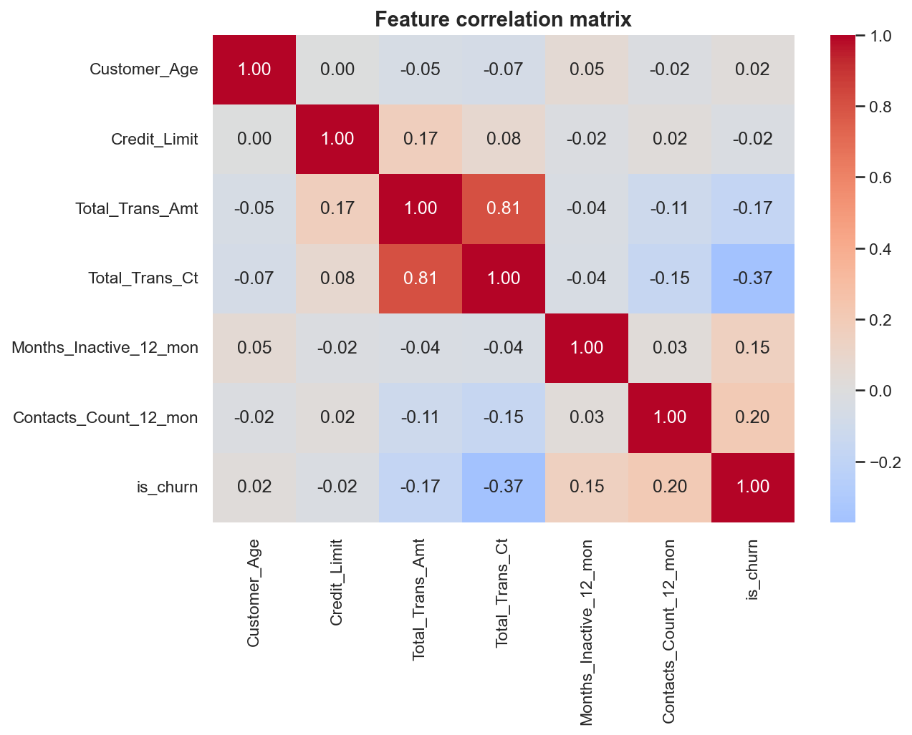
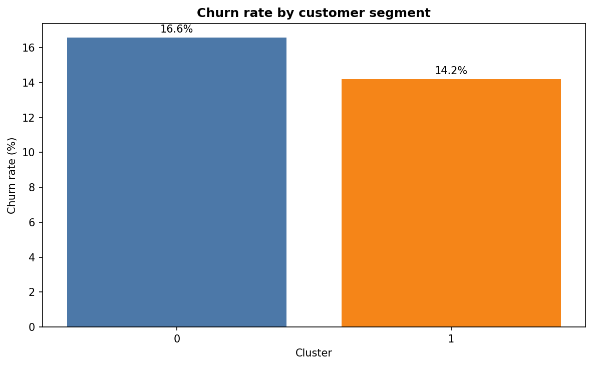
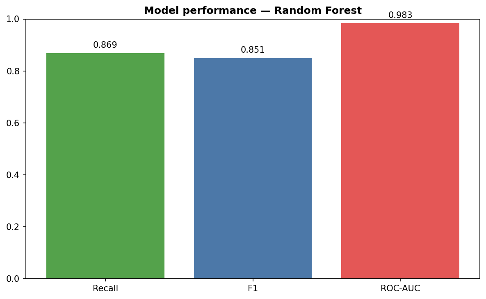

# Credit Card Churn Prediction

[](https://churn-dashboard-wrtu.onrender.com/)

## What is this?

A **customer retention toolkit** for a bank facing rising credit card churn (~16%).

Marketing teams get three things out of the box:

1. **Risk scoring** — flag clients likely to leave before they do
2. **Customer segments** — group clients by behaviour for targeted campaigns
3. **Live dashboard** — KPIs, model performance, and interactive predictions

Built as a BeCode consolidation project (Data Engineer + ML Engineer + Data Analyst).

**Live demo:** [https://churn-dashboard-wrtu.onrender.com/](https://churn-dashboard-wrtu.onrender.com/)

| App | URL |
|-----|-----|
| Dashboard (Streamlit) | [churn-dashboard-wrtu.onrender.com](https://churn-dashboard-wrtu.onrender.com/) |
| Dashboard (Power BI) | _Create with [powerbi/README.md](powerbi/README.md) → publish → paste URL here_ |
| Dashboard (Tableau) | _Create with [tableau/README.md](tableau/README.md) → Tableau Public → paste URL here_ |
| API (FastAPI) | _Add your Render API URL here when deployed_ |

---

## Results at a glance

### Key metrics

| KPI | Value |
|-----|------:|
| Total customers | 10,127 |
| Churn rate | **16.1%** |
| Existing customers | 8,500 |
| Attrited customers | 1,627 |

### Churn split

```text
Existing Customer  ████████████████████████████████████████████████  84%
Attrited Customer  █████████                                         16%
```

### Screenshots

**Dashboard KPIs**



**Churn overview**



**Churn by card category**



**Feature correlations**



**Customer segments (KMeans)**



**Model performance (Random Forest)**



> Regenerate images: `python scripts/run_training.py` then `python scripts/generate_readme_images.py`

### What the charts show

**EDA notebook** (`notebooks/01_eda.ipynb`)

- Churn rate breakdown (Existing vs Attrited)
- Numeric feature distributions by churn status (age, credit limit, transactions…)
- Churn rate by card category, income, education
- Correlation heatmap — top signals: `Total_Trans_Amt`, `Total_Trans_Ct`, `Contacts_Count_12_mon`, `Months_Inactive_12_mon`

**Streamlit dashboard** (`app/dashboard/app.py`)

| Tab | Visual output |
|-----|---------------|
| Exploration | KPI cards, churn bar chart, churn-by-card-category chart |
| ML Model | Recall / F1 / ROC-AUC metrics for the best classifier |
| Customer Segments | Cluster table + churn-rate bar chart per segment |
| Prediction | Live churn probability + risk level (low / medium / high) |

**Power BI & Tableau** ([`powerbi/`](powerbi/) · [`tableau/`](tableau/) · [`bi/COMPARISON.md`](bi/COMPARISON.md))

Same **ML model scores** exported to CSV — not a separate analysis:

```bash
python scripts/run_training.py          # train models
python scripts/export_for_powerbi.py    # export to powerbi/ + tableau/ data
```

| ML column in CSV | Meaning |
|------------------|---------|
| `ChurnProbability` | Random Forest score (0–1) |
| `PredictedChurn` | Model prediction (threshold 0.5) |
| `RiskLevel` | low / medium / high |
| `ML_Cluster` | KMeans segment |
| `PredictionMatch` | Correct vs actual `IsChurn` |

| Tool | Best for |
|------|----------|
| Streamlit | Live ML prediction form + Render deploy |
| Power BI | Business KPIs + ML charts (DAX) |
| Tableau | BeCode DA requirement — clustering comparison vs ML |

### Main findings

- Churn is **imbalanced** (~16% positive class) → SMOTE applied during training
- **Low activity** (inactive months, low transaction count) strongly correlates with churn
- **Blue card** holders show higher churn rates — priority segment for retention campaigns
- **Random Forest** wins on recall vs Logistic Regression (**0.87 recall** on test set)

---

## Technical documentation

### Stack

| Layer | Technology |
|-------|------------|
| Storage | SQLite |
| EDA | Jupyter |
| ML | scikit-learn + imbalanced-learn (SMOTE) |
| Clustering | KMeans (silhouette score) |
| API | FastAPI |
| Dashboard | Streamlit |
| Deploy | Docker + Render |

See also [`CRITERIA.md`](CRITERIA.md) (BeCode brief) · [`PROJECT_PLAN.md`](PROJECT_PLAN.md) (technical plan)

### Installation

**Requirements:** Python 3.10+

```bash
git clone https://github.com/dimiphoton/credit-card-churn-prediction.git
cd credit-card-churn-prediction

python -m venv .venv

# Windows
.venv\Scripts\activate

# Linux / macOS
source .venv/bin/activate

pip install -r requirements.txt
```

### Usage

**1. Train the pipeline**

```bash
python scripts/run_training.py
```

Outputs: `data/processed/churn.db`, models in `models/`.

**2. Start the API**

```bash
# Windows
set PYTHONPATH=src

# Linux / macOS
export PYTHONPATH=src

uvicorn app.api.main:app --reload --port 8000
```

| Endpoint | Description |
|----------|-------------|
| `GET /health` | API health check |
| `GET /ready` | Model loaded |
| `GET /metrics` | ML metrics (recall, F1, ROC-AUC) |
| `POST /predict` | Churn prediction |
| `GET /docs` | Swagger UI |

**3. Start the dashboard**

```bash
streamlit run app/dashboard/app.py
```

→ http://localhost:8501

**4. Docker**

```bash
docker compose up --build
```

| Service | URL |
|---------|-----|
| API | http://localhost:8000 |
| Dashboard | http://localhost:8501 |

**5. Tests**

```bash
pytest
```

31 tests covering ingestion, preprocessing, ML, API, and full pipeline.

### Model choices & limitations

**Classification**

- Target: `Attrition_Flag` (binary)
- Models: Logistic Regression (baseline) + Random Forest
- Imbalance handled with SMOTE on the training set
- Best model selected by **recall** on the test set

**Clustering**

- KMeans on scaled features, optimal K via silhouette score (K = 2–8)
- Output: cluster profiles (size, churn rate, avg age, avg transactions)

**Limitations**

- Static historical data — no macro-economic or competitor variables
- Label encoding on categoricals (not one-hot)
- High recall → more false positives (broader marketing outreach)
- Periodic retraining recommended in production

### Deploy on Render

The web apps are **configured but not auto-deployed** — you need to trigger Render once from your dashboard.

**What gets deployed**

| Service | App | URL path |
|---------|-----|----------|
| `churn-api` | FastAPI REST API | `/docs`, `/predict`, `/health` |
| `churn-dashboard` | Streamlit dashboard | `/` (KPIs, segments, prediction form) |

**Steps (5 min)**

1. Go to [Render Dashboard](https://dashboard.render.com)
2. Click **New +** → **Blueprint**
3. Connect repo: `dimiphoton/credit-card-churn-prediction`
4. Render reads [`render.yaml`](render.yaml) and creates 2 web services
5. Click **Apply** — wait for build (~3–5 min per service)
   - Build runs `pip install` + `run_training.py` (trains models in the cloud)
6. Copy your live URLs from the Render dashboard

**Verify deployment**

```bash
# Dashboard (browser)
https://churn-dashboard-wrtu.onrender.com

# API — replace with your Render API URL when available
# curl https://YOUR-API-URL.onrender.com/health
```

**Free tier notes**

- Services spin down after ~15 min idle → first request may take 30–60 s (cold start)
- 2 web services = 2 free instances (within Render free limits)
- Models are trained at **build time** (not stored in Git — `models/` is gitignored)

**Config files:** [`render.yaml`](render.yaml) · [`runtime.txt`](runtime.txt) · [`Dockerfile`](Dockerfile) (alternative via Docker)

### Project structure

```text
credit-card-churn-prediction/
├── src/churn/              # Core library
│   ├── ingest.py           # CSV → SQLite
│   ├── cleaning.py
│   ├── features.py
│   ├── train.py            # Classification + SMOTE
│   ├── clustering.py       # KMeans
│   └── predict.py
├── app/
│   ├── api/main.py         # FastAPI
│   └── dashboard/app.py    # Streamlit
├── tests/
├── notebooks/01_eda.ipynb
├── scripts/run_training.py
├── scripts/export_for_powerbi.py
├── powerbi/                # Power BI guide + CSV for Desktop
├── data/raw_data/bank_data.csv
├── Dockerfile
├── docker-compose.yml
└── render.yaml
```

### Git workflow

Feature branches merged into `main` step by step:

`feature/01-scaffold` → `02-database` → `03-eda` → `04-preprocessing` → `05-ml-models` → `06-tests` → `07-fastapi-docker` → `08-streamlit` → `09-deploy-docs`

### Contributors

- **Dimitri Marchand** ([@dimiphoton](https://github.com/dimiphoton)) — Data Engineering, ML, Dashboard, Deployment

### Dataset

[Credit Card Customers (Kaggle)](https://www.kaggle.com/sakshigoyal7/credit-card-customers)
